# Lista de Tarefas

Aplicativo de lista de tarefas desenvolvido como trabalho acadêmico da **FASEC** para a disciplina **Desenvolvimento Mobile**.

## Sobre o projeto

Este projeto foi criado para colocar em prática os fundamentos do Flutter e do Dart no desenvolvimento de uma aplicação mobile multiplataforma. A proposta é construir uma experiência simples, funcional e preparada para receber novos recursos.

## Por que estamos aprendendo Flutter?

O Flutter permite criar aplicações para diferentes plataformas a partir de uma única base de código, usando widgets reutilizáveis e uma interface declarativa. Durante a disciplina, o framework ajuda a estudar conceitos importantes do desenvolvimento mobile, como:

- Construção de interfaces responsivas
- Gerenciamento de estado
- Interação com o usuário
- Organização de projetos mobile
- Execução para Android, iOS, Web e desktop

## Funcionalidades

- Adicionar tarefas pelo botão ou pressionando `Enter`
- Exibir as tarefas cadastradas em uma lista
- Remover tarefas individualmente
- Informar quando a lista está vazia

## Objetos interativos e efeitos especiais

A interface foi pensada para evoluir com objetos interativos, como campos de entrada, botões, cartões e ícones de ação. Entre os efeitos especiais que podem ser incorporados nas próximas versões estão:

- Animação ao adicionar e remover tarefas
- Transições suaves nos cartões da lista
- Feedback visual ao concluir uma tarefa
- Tema visual personalizado para tornar a experiência mais agradável

```mermaid
flowchart TD
		A[Usuário abre o aplicativo] --> B[Digite uma tarefa]
		B --> C{Tarefa válida?}
		C -- Não --> B
		C -- Sim --> D[Clique em Adicionar ou pressione Enter]
		D --> E[Tarefa aparece na lista]
		E --> F[Clique no ícone de lixeira]
		F --> G[Tarefa é removida]
```

<details>
<summary>Ver fluxo principal da aplicação</summary>



</details>

## Como executar

### Pré-requisitos

- Flutter SDK
- Dart SDK, incluído no Flutter
- Google Chrome, Android Studio ou outro dispositivo compatível

### Passos

```bash
git clone https://github.com/jp-devl/lista_tarefa-master.git
cd lista_tarefa-master
flutter pub get
flutter run -d chrome
```

## Estrutura principal

```text
lib/
	main.dart       # Interface e lógica principal da lista de tarefas
pubspec.yaml      # Configurações e dependências do projeto
```

## Tecnologias


## Agradecimentos

Agradeço à **FASEC** pela oportunidade de aprendizado e ao professor da disciplina **Desenvolvimento Mobile** pelas orientações durante a construção deste projeto.

Também agradeço à comunidade Flutter e Dart, à documentação oficial e a todos que compartilham conhecimento sobre desenvolvimento de aplicações multiplataforma.

---

Projeto acadêmico desenvolvido por **João Pedro Moreira Martins de Sousa**.

