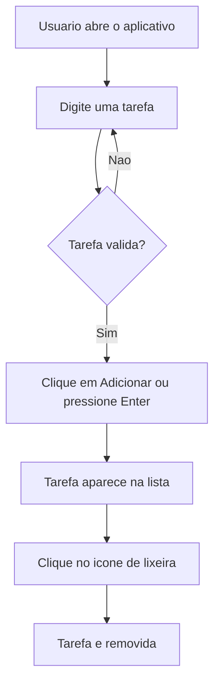

# Lista de Tarefas

Aplicativo de lista de tarefas desenvolvido como trabalho academico da **FASEC** para a disciplina **Desenvolvimento Mobile**.

## Sobre o projeto

Este projeto foi criado para colocar em pratica os fundamentos do Flutter e do Dart no desenvolvimento de uma aplicacao mobile multiplataforma. A proposta e construir uma experiencia simples, funcional e preparada para receber novos recursos.

## Por que estamos aprendendo Flutter?

O Flutter permite criar aplicacoes para diferentes plataformas a partir de uma unica base de codigo, usando widgets reutilizaveis e uma interface declarativa. Durante a disciplina, o framework ajuda a estudar conceitos importantes do desenvolvimento mobile, como:

- Construcao de interfaces responsivas
- Gerenciamento de estado
- Interacao com o usuario
- Organizacao de projetos mobile
- Execucao para Android, iOS, Web e desktop

## Funcionalidades

- Adicionar tarefas pelo botao ou pressionando `Enter`
- Exibir as tarefas cadastradas em uma lista
- Remover tarefas individualmente
- Informar quando a lista esta vazia

## Objetos interativos e efeitos especiais

A interface foi pensada para evoluir com objetos interativos, como campos de entrada, botoes, cartoes e icones de acao. Entre os efeitos especiais que podem ser incorporados nas proximas versoes estao:

- Animacao ao adicionar e remover tarefas
- Transicoes suaves nos cartoes da lista
- Feedback visual ao concluir uma tarefa
- Tema visual personalizado para tornar a experiencia mais agradavel

<details>
<summary>Ver fluxo principal da aplicacao</summary>



</details>

## Como executar

### Pre-requisitos

- Flutter SDK
- Dart SDK, incluido no Flutter
- Google Chrome, Android Studio ou outro dispositivo compativel

### Passos

```bash
git clone https://github.com/jp-devl/lista_tarefa-master.git
cd lista_tarefa-master
flutter pub get
flutter run -d chrome
```

## Estrutura principal

```text
lib/
	main.dart       # Interface e logica principal da lista de tarefas
pubspec.yaml      # Configuracoes e dependencias do projeto
```

## Tecnologias


## Agradecimentos

Agradeco a **FASEC** pela oportunidade de aprendizado e ao professor da disciplina **Desenvolvimento Mobile** pelas orientacoes durante a construcao deste projeto.

Tambem agradeco a comunidade Flutter e Dart, a documentacao oficial e a todos que compartilham conhecimento sobre desenvolvimento de aplicacoes multiplataforma.

---

Projeto academico desenvolvido por **Joao Pedro Moreira Martins de Sousa**.

